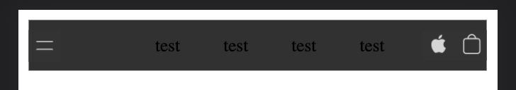
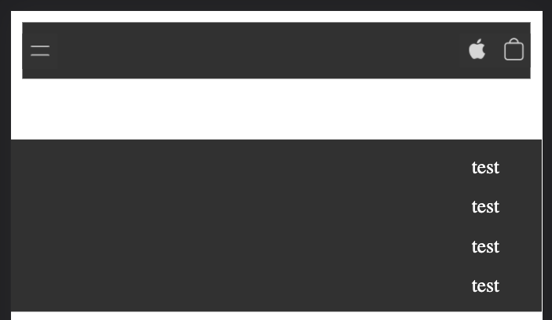
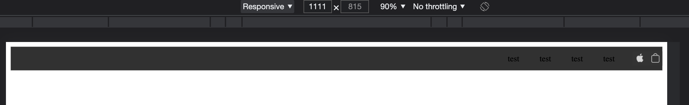
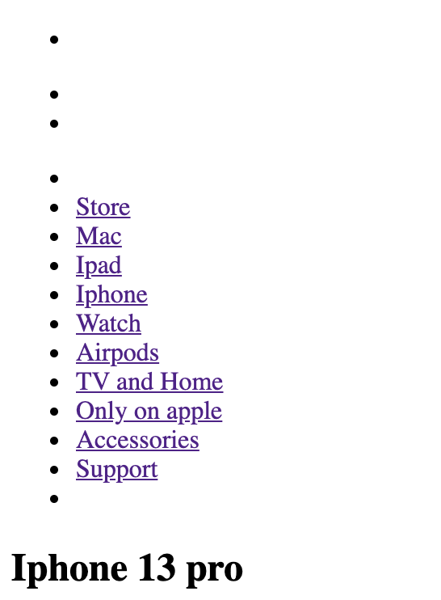
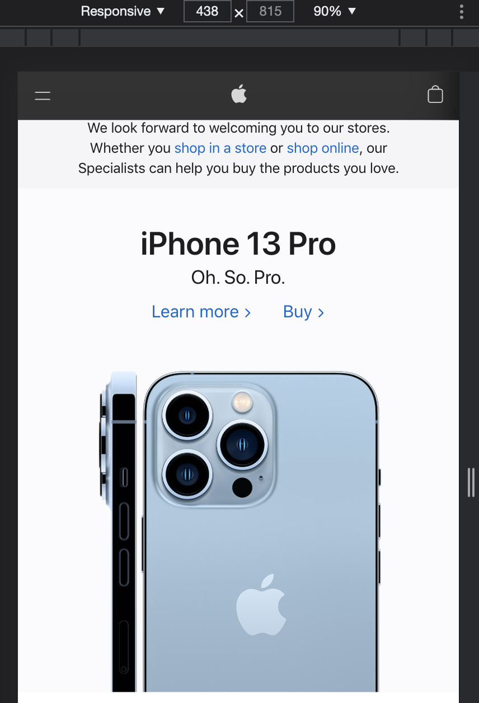
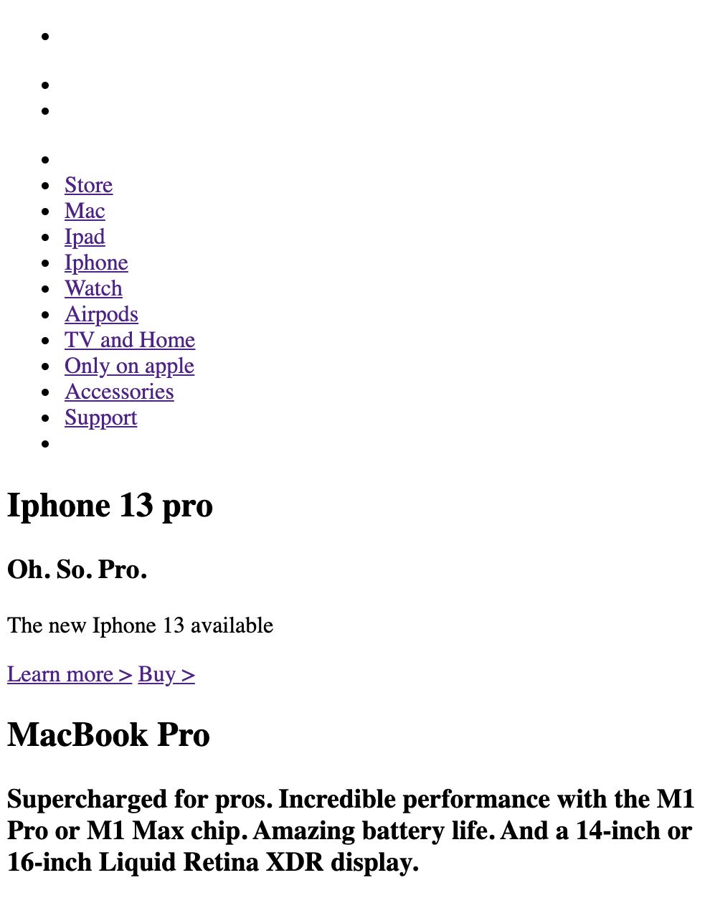
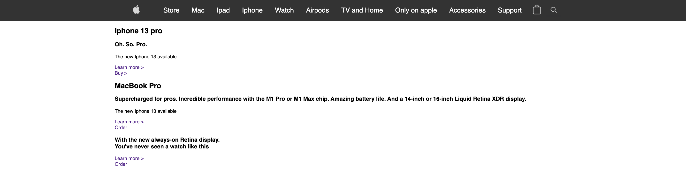
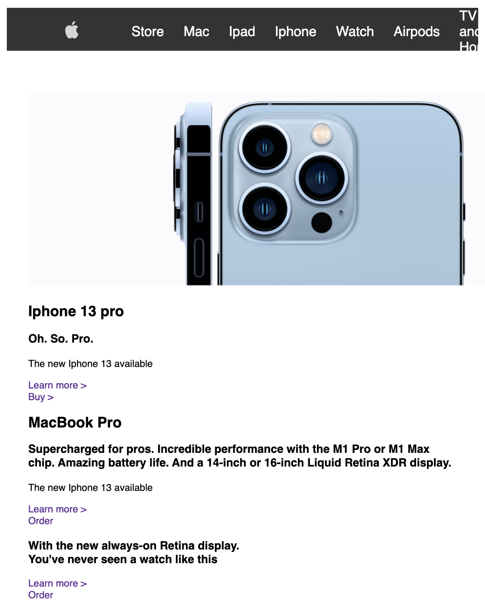

# Procesverslag
Markdown is een simpele manier om HTML te schrijven.  
Markdown cheat cheet: [Hulp bij het schrijven van Markdown](https://github.com/adam-p/markdown-here/wiki/Markdown-Cheatsheet).

Nb. De standaardstructuur en de spartaanse opmaak van de README.md zijn helemaal prima. Het gaat om de inhoud van je procesverslag. Besteedt de tijd voor pracht en praal aan je website.

Nb. Door *open* toe te voegen aan een *details* element kun je deze standaard open zetten. Fijn om dat steeds voor de relevante stuk(ken) te doen.

## Jij

uitwerken voor kick-off werkgroep

### Auteur:
Emilio Manduapessij

#### Je startniveau:
Blauw

#### Je focus:
Surface plane
 

## Je website

uitwerken voor kick-off werkgroep

### Je opdracht:
Ik ga proberen de website van Apple na te maken.
Links zie je de screenshot van de eerste pagina, rechts zie je de detailpagina. 
 

  
  

 
 

## Breakdownschets

uitwerken na afloop 2e werkgroep

### de hele pagina: 

### de tweede pagina: 

### Dynamisch deel: 

## Voortgang 1

uitwerken voor 1e voortgang

### Stand van zaken
Allereerst ben ik begonnen met de code en css van de navbar. Ik heb hiervoor als bron gebruikt:
 https://developer.mozilla.org/en-US/docs/Web/HTML/Element/nav
 
 Echter liep ik tegen mijn eerste probleem op: Er zit een rand romdom de viewport, zie bijstaande foto:
 
 

 Na het proberen weg te werken van de witte rand (waar ik nog niet achter ben gekomen hoe dit komt) heb ik mijn focus verlegd op het volledig maken van het menu. Om het responsive te maken én het gebruik van een beetje javascript voor een smooth verloop van de uitklap. Voor de media nquiry heb ik als bron gebruikt: https://www.w3schools.com/cssref/css3_pr_mediaquery.asp , Hierin heb ik ervoor gezorgd dat de hamburger icon verdwijnt zodra het scherm groter is dan 700px.

 Zie bijstaande foto's:
 
 

  
  
  

 

## Voortgang 2

uitwerken voor 2e voortgang

Om de uitklapbalk van het menu bewegend te krijgen moet ik Javascript gebruiken. Hiervoor gebruik je de onclick op het menu icoontje met Toggle menu. Dit weet ik nog uit de frontend lessen. Helaas reageert mijn javascript niet. Op het moment dat ik het menu-icoontje wil laten uitklappen reageert hij niet. Dit heeft volgens Brackets twee oorzaken: Foutmelding 1 is dat de "if" een "unexpected token" aangeeft, foutmelding twee geeft aan dat mijn element niet word aangeroepen. Na letterlijk een uur lopen kloten kom ik er nog steeds niet uit.. Ik ben begonnen met een nieuwe navbar aan te maken via een andere bron omdat ik anders te veel onnodige tijd verlies. 
 
Nu ik begonnen ben met de nieuwe nav, is mijn structuur enigzins anders. Ik ben begonnen met enkel het HTML bestand. Gevolgd via de bron: https://itnext.io/how-to-create-a-responsive-navigation-bar-with-html-css-and-jquery-step-by-step-tutorial-9c780b58479f
 
 Zie voortgang hier (hero section is inmiddels veranderd):

  
  
 
  

 

 Als laatste ben ik gestart met het indelen van de sections onder de navigatie balk, zie proces hieronder:
 
 
 

Voor zover ik nu ben: Navigatie begint vorm te krijgen en lijkt op de apple website. Icoontjes krijg ik met CSS nog niet op de juiste plek en grootte. Zie proces:

Nu ik mijn section heb ingedeeld struggle ik met het correct plaatsen van mijn achtergrond foto, dit wil nog niet lukken. Zie bijgevoegde foto:

## Toegankelijkheidstest

uitwerken na test in 8e voortgang

### Bevindingen
Lijst met je bevindingen die in de test naar voren kwamen:

#### Titel eerste bevinding
Hier korte omschrijving (met indien nodig een afbeelding)

Hier een omschrijving van hoe het opgelost kan worden (met indien nodig een afbeelding)

#### Titel tweede bevinding. 
Hier korte omschrijving (met indien nodig een afbeelding)

Hier een omschrijving van hoe het opgelost kan worden (met indien nodig een afbeelding)

#### Titel volgende bevinding. 
Hier korte omschrijving (met indien nodig een afbeelding)

Hier een omschrijving van hoe het opgelost kan worden (met indien nodig een afbeelding)

#### Titel nog een bevinding. 
Hier korte omschrijving (met indien nodig een afbeelding)

Hier een omschrijving van hoe het opgelost kan worden (met indien nodig een afbeelding)

## Voortgang 3

uitwerken voor 3e voortgang

### Stand van zaken
hier dit ging goed & dit was lastig (neem ook screenshots op van delen van je website en code)

### Agenda voor meeting
samen met je groepje opstellen

| student 1      | student 2          | student 3    | student 4        |
| ---            | ---                | ---          | ---              |
| dit bespreken  | en dit             | en ik dit    | en dan ik dat    |
| en dat ook nog | dit als er tijd is | nog een punt | dit wil ik zeker |
| ...            | ...                | ...          | ...              |

### Verslag van meeting
hier na afloop snel de uitkomsten van de meeting vastleggen

- punt 1
- punt 2
- nog een punt
- ...

## Eindgesprek

uitwerken voor eindgesprek

### Stand van zaken
hier dit ging goed & dit was lastig (neem ook screenshots op van delen van je website en code)

### Screenshot(s)

hier screenshot(s) van je eindresultaat

## Bronnenlijst

continu bijhouden terwijl je werkt

Nb. Wees specifiek ('css-tricks' als bron is bijv. niet specifiek genoeg).

1. bron 1
2. bron 2
3. ...

