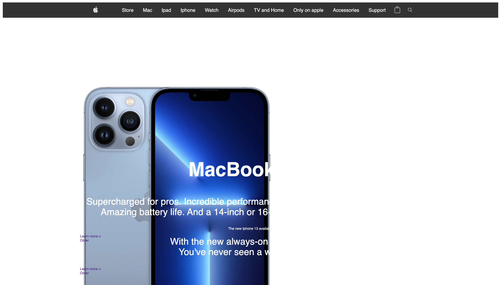
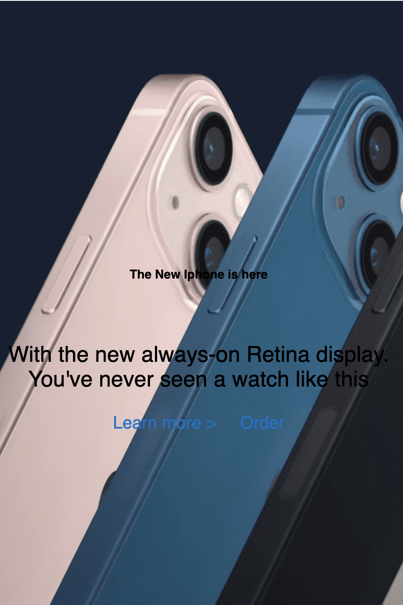

# Procesverslag

## Jij

uitwerken voor kick-off werkgroep

### Auteur:
Emilio Manduapessij

#### Je startniveau:
Blauw

#### Je focus:
Surface plane
 

## Je website

### Je opdracht:
Ik ga proberen de website van Apple na te maken.
Links zie je de screenshot van de eerste pagina, rechts zie je de detailpagina. 
 

  
  

 
 

## Breakdownschets

uitwerken na afloop 2e werkgroep

### de hele pagina: 

### de tweede pagina: 

### Dynamisch deel: 

## Voortgang 1

uitwerken voor 1e voortgang

### Stand van zaken
Allereerst ben ik begonnen met de code en css van de navbar. Ik heb hiervoor als bron gebruikt:
 https://developer.mozilla.org/en-US/docs/Web/HTML/Element/nav
 
 Echter liep ik tegen mijn eerste probleem op: Er zit een rand romdom de viewport, zie bijstaande foto:
 
 

 Na het proberen weg te werken van de witte rand (waar ik nog niet achter ben gekomen hoe dit komt) heb ik mijn focus verlegd op het volledig maken van het menu. Om het responsive te maken én het gebruik van een beetje javascript voor een smooth verloop van de uitklap. Voor de media nquiry heb ik als bron gebruikt: https://www.w3schools.com/cssref/css3_pr_mediaquery.asp , Hierin heb ik ervoor gezorgd dat de hamburger icon verdwijnt zodra het scherm groter is dan 700px.

 Zie bijstaande foto's:
 
 

  
  
  

 

## Voortgang 2

uitwerken voor 2e voortgang

Om de uitklapbalk van het menu bewegend te krijgen moet ik Javascript gebruiken. Hiervoor gebruik je de onclick op het menu icoontje met Toggle menu. Dit weet ik nog uit de frontend lessen. Helaas reageert mijn javascript niet. Op het moment dat ik het menu-icoontje wil laten uitklappen reageert hij niet. Dit heeft volgens Brackets twee oorzaken: Foutmelding 1 is dat de "if" een "unexpected token" aangeeft, foutmelding twee geeft aan dat mijn element niet word aangeroepen. Na letterlijk een uur lopen kloten kom ik er nog steeds niet uit.. Ik ben begonnen met een nieuwe navbar aan te maken via een andere bron omdat ik anders te veel onnodige tijd verlies. 
 
Nu ik begonnen ben met de nieuwe nav, is mijn structuur enigzins anders. Ik ben begonnen met enkel het HTML bestand. Gevolgd via de bron: https://itnext.io/how-to-create-a-responsive-navigation-bar-with-html-css-and-jquery-step-by-step-tutorial-9c780b58479f
 
 Zie voortgang hier (hero section is inmiddels veranderd):

  
  
 
  

 

 Als laatste ben ik gestart met het indelen van de sections onder de navigatie balk, zie proces hieronder:
 
 
 

Voor zover ik nu ben: Navigatie begint vorm te krijgen en lijkt op de apple website. Icoontjes krijg ik met CSS nog niet op de juiste plek en grootte. Zie proces:

Nu ik mijn section heb ingedeeld struggle ik met het correct plaatsen van mijn achtergrond foto, dit wil nog niet lukken. Zie bijgevoegde foto:

Vervolgens heb ik de achtergrond foto erachter gekregen, dit is voor nu een tijdelijke foto omdat de website vrij veel veranderd, zie foto:

Het probleem waar ik momenteel tegen aanloop is de titel die onder de section lijkt te komen, hoe krijg ik een foto als background, dit klinkt als iets simpels maar momenteel lukt het me niet om uit te vogelen hoe dit werkt. Ook niet met de bron https://www.digitalocean.com/community/tutorials/how-to-add-a-background-image-to-the-top-section-of-your-webpage-with-html 

Voor het bepalen van de kleuren voor bijvoorbeeld de Cta en headers, gebruik ik Color slurp chrome extension, hiermee achterhaal je de hex code vanuit de webpagina, zo krijg ik exact de kleuren van de Apple website zelf.

## Toegankelijkheidstest

## Voortgang 3

uitwerken voor 3e voortgang

Nu ik voor 80% (gedeelte sections lukken me niet volledig) de html structuur heb met css, ga ik me focussen op responsivness en media query.
Voor het gebruik van een mooi responsive menu heb ik op W3 schools de cubic bezier gevonden, dit had ik zelf nooit geleerd bij Fed of JS, vond het daarom interessant om dit te gebruiken: https://www.w3schools.com/cssref/func_cubic-bezier.asp update: Cubic bezier is niet gelukt omdat het mij niet lukte om de pagina responsive te maken. De navbar verdwijnt op het moment dat mijn scherm kleiner is dan 500px.
 
Bij een kleiner scherm anticipeerde mijn tekst wel goed en gewenst, dit was 1 van de weinig lichtpunten:

 
 
 

## Eindgesprek

uitwerken voor eindgesprek

### Stand van zaken
Zoals verwacht ging er niet heel veel goed. Ik vind het snappen van de volledige talen en hoe deze (HTML, CSS en JS) met elkaar communiceren zeer lastig. Ik begrijp de structuur nog steeds niet en probeer vanuit logica te denken. Dit maakt het proces voor mij als een complete sleur. Ik vind het niet leuk en ik ben er alles behalve vaardig in. Tijdens dit project liep ik tegen het volgende:
 
 1. Ik kreeg iets simpels zoals een achtergrond correct toevoegen in een Div niet voor elkaar. Hiermee heb ik lopen sjoemelen om de tekst in de section wel over de image heen te krijgen. Echter weet ik dondersgoed dat dit niet de manier is. 
 
 2. Gebruik van alle bronnen door elkaar maakt mijn structuur van werken nog gecompliceerder. Omdat ik bepaalde handwijzes overneem vanuit bijvoorbeeld w3 schools en youtube. Komt de code niet altijd overeen in het geheel. Voor de Navbar sloeg mijn css nog enigzins aan. Maar toen ik responsife design wilde maken, verdween mijn gehele balk bij een scherm kleiner dan 500px. Hier stagneerde ik en kon ik eigenlijk niet verder omdat ik anders de hele code moest herschrijven.
 
 3. 

### Screenshot(s)

hier screenshot(s) van je eindresultaat

## Bronnenlijst

continu bijhouden terwijl je werkt

Nb. Wees specifiek ('css-tricks' als bron is bijv. niet specifiek genoeg).

1. bron 1
2. bron 2
3. ...

